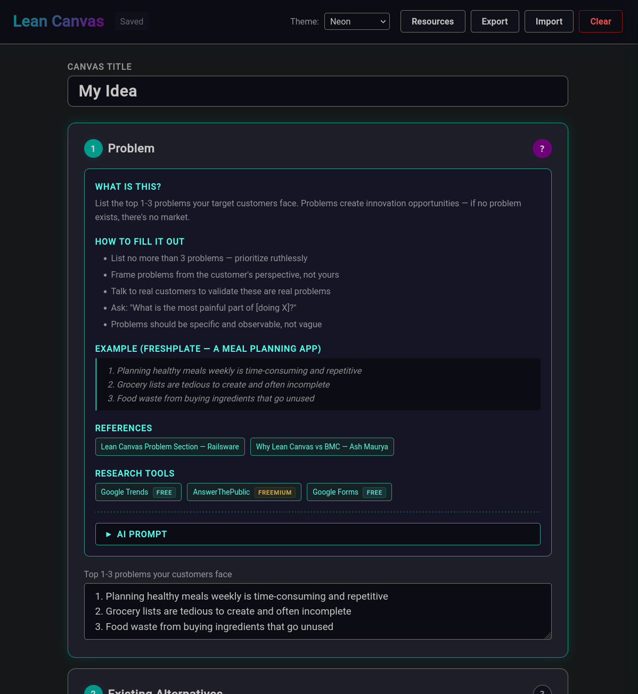

# Lean Canvas Builder

A guided, interactive Lean Canvas tool for entrepreneurs and startup founders. Fill out each section step-by-step, get help with built-in guides, AI prompts, and curated research tools, then generate a printable canvas.



## What is Lean Canvas?

[Lean Canvas](https://www.leanfoundry.com/articles/what-is-lean-canvas) is a 1-page business model framework created by Ash Maurya, adapted from Alexander Osterwalder's Business Model Canvas. It helps entrepreneurs deconstruct their idea into key assumptions that can be tested quickly.

This tool walks you through the canvas in a recommended fill order, with educational content and tools for each step.

## Features

- **Guided 12-step fill order** — Sections are ordered for optimal flow, starting with Problem and ending with Key Metrics
- **Built-in help system** — Each section includes "What is this?", "How to fill it out", a worked example (FreshPlate meal planning startup), reference articles, and curated research tools
- **AI prompts** — Every section has a ready-to-copy prompt you can paste into ChatGPT, Claude, or any AI assistant to get help filling it out
- **Resource panel** — Slide-out sidebar with 39 tools across 8 categories (Problem Discovery, Competitive Research, Audience Research, Prototyping, Copywriting, Marketing, Financial Planning, Analytics), each tagged as free, freemium, or paid
- **9 themes** — Dark, Neon, Cyberpunk, Synthwave, Matrix, Aurora, Light, Blueprint, Warm — including glow effects on the neon/dark themes
- **Auto-save** — All input is saved to localStorage automatically with a 300ms debounce
- **JSON export/import** — Export your canvas as a JSON file (with file picker on supported browsers) and import it later or on another device
- **Printable canvas** — Generate a classic Lean Canvas grid layout optimized for US Letter landscape printing
- **Zero dependencies** — Pure HTML, CSS, and JavaScript. No build step, no frameworks, no external requests
- **Works offline** — Open the file in any browser and start working

## Quick Start

No installation required. Just open the HTML file in a browser.

### Option 1: Clone and open

```bash
git clone https://github.com/miswired/leancanvas.git
cd leancanvas
open index.html        # macOS
xdg-open index.html    # Linux
start index.html       # Windows
```

### Option 2: Download

Download the repository as a ZIP from GitHub, extract it, and open `index.html` in your browser.

### Option 3: Serve locally

If you want to serve it over HTTP (optional — not required):

```bash
# Python
python3 -m http.server 8000

# Node.js
npx serve .
```

Then visit `http://localhost:8000`.

## Usage

1. **Fill out each section** — Work through the 12 steps in order. Click the **?** button on any section to see help, examples, references, tools, and an AI prompt.
2. **Use the Resource panel** — Click **Resources** in the header to browse all available tools grouped by category.
3. **Generate your canvas** — Click **Generate Canvas** to see the classic Lean Canvas grid layout.
4. **Print or export** — Use the **Print** button for a paper copy (US Letter landscape), or **Export** to save as JSON.
5. **Switch themes** — Use the theme dropdown in the header.

## File Structure

```
leancanvas/
├── index.html          # Main HTML structure
├── styles.css          # All styles including 9 themes and print styles
├── app.js              # Application logic, help content, resource data
├── LICENSE             # GPL-3.0
├── README.md
├── .gitignore
├── CLAUDE.md           # AI assistant instructions (OpenSpec)
├── AGENTS.md           # AI assistant instructions (OpenSpec)
├── .claude/            # Claude Code slash commands
│   └── commands/
│       └── openspec/   # /proposal, /apply, /archive commands
└── openspec/           # OpenSpec project documentation
    ├── project.md
    ├── AGENTS.md
    └── changes/
        └── add-lean-canvas-app/
            ├── proposal.md
            ├── design.md
            ├── tasks.md
            └── specs/      # Capability specifications
```

## Themes

| Theme | Description |
|-------|-------------|
| **Neon** (default) | Teal and magenta glow on dark background, inspired by GitKraken Glo Boards |
| **Cyberpunk** | Hot pink, electric yellow, and cyan with strong glow effects |
| **Synthwave** | Retro 80s purple, pink, and orange sunset palette |
| **Matrix** | Green phosphor on black with monospace font |
| **Aurora** | Northern lights with green, blue, and purple shifts |
| **Dark** | Clean dark theme with blue accents |
| **Light** | Clean light theme with blue accents |
| **Blueprint** | Deep navy with engineering blueprint aesthetic |
| **Warm** | Earthy tones with warm orange accents |

## Browser Support

Works in all modern browsers:
- Chrome / Edge (full support including file picker export)
- Firefox
- Safari

## Data & Privacy

All data stays in your browser. Nothing is sent to any server. Canvas data is stored in `localStorage` and can be exported as a local JSON file.

## Contributing

Contributions are welcome! This project uses [OpenSpec](https://github.com/openspec-tools/openspec) for specification-driven development and supports AI-assisted development with Claude Code.

1. Fork the repository
2. Create a feature branch
3. Make your changes
4. Submit a pull request

## License

[GPL-3.0](LICENSE) — Free to use, modify, and distribute. Derivative works must also be open source.

## Credits

- Based on [Lean Canvas](https://www.leanfoundry.com/articles/what-is-lean-canvas) by Ash Maurya
- Built with Claude Code
